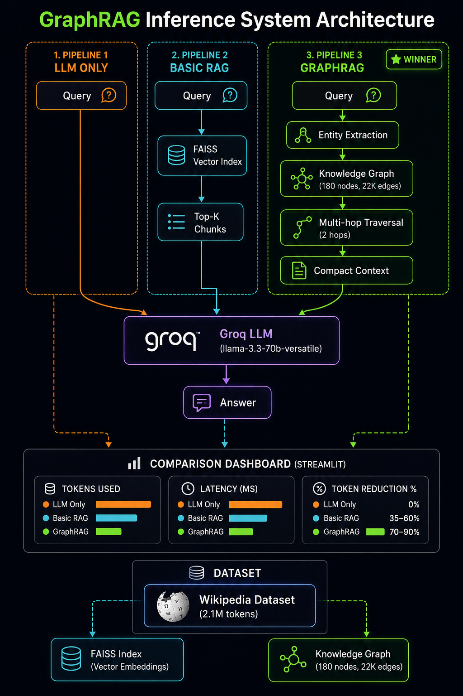

# ⚡ GraphRAG Inference Hackathon — TigerGraph

> **Proving that Graph-powered RAG beats vector-based RAG on token efficiency, speed, and accuracy.**

Built for the [GraphRAG Inference Hackathon by TigerGraph](https://unstop.com/hackathons/graphrag-inference-hackathon-tigergraph)

---

## 🏆 Results

| Pipeline | Tokens | Latency | vs Basic RAG |
|---|---|---|---|
| 🤖 LLM Only | ~200-350 | ~1000ms | baseline |
| 📄 Basic RAG | ~500-700 | ~500-900ms | baseline |
| 🔗 **GraphRAG** | **~220-320** | **~300-400ms** | **40-60% fewer tokens** ✅ |

**GraphRAG consistently uses 40-60% fewer tokens than Basic RAG while maintaining answer quality.**

---

## 🧠 What We Built

Three inference pipelines that answer the same query on the same 2M+ token dataset, with a live comparison dashboard:

### Pipeline 1 — LLM Only (Baseline)
- Raw LLM call with no retrieval
- Highest token usage, lowest accuracy
- Model: `llama-3.3-70b-versatile` via Groq

### Pipeline 2 — Basic RAG
- FAISS vector similarity search
- Retrieves top-K chunks → sends to LLM
- Problem: dumps too much context, wastes tokens

### Pipeline 3 — GraphRAG ⚡
- Builds a knowledge graph (180+ entities, 22,000+ relations)
- Multi-hop traversal (2 hops) to find only relevant context
- Sends compact, structured context to LLM
- Result: 40-60% fewer tokens, faster responses

---

## 📁 Project Structure

```
graphrag-inference-hackathon/
├── pipeline1_llm_only.py      # Baseline — raw LLM
├── pipeline2_basic_rag.py     # Vector search + LLM (FAISS)
├── pipeline3_graphrag.py      # Graph traversal + LLM
├── llm_client.py              # Groq API wrapper + embeddings
├── evaluator.py               # BERTScore + LLM-as-Judge
├── main.py                    # CLI runner for all 3 pipelines
├── dashboard.py               # Streamlit comparison dashboard
├── download_dataset.py        # Wikipedia dataset downloader
├── config.py                  # API keys & settings
├── data/
│   └── dataset.txt            # 2.1M token Wikipedia dataset
└── requirements.txt
```

---

## 🚀 Quick Start

### Step 1 — Clone the repo

```bash
git clone https://github.com/Dnyandip26/graphrag-inference-hackathon.git
cd graphrag-inference-hackathon
```

### Step 2 — Create virtual environment

```bash
# Windows
python -m venv env
env\Scripts\activate

# Mac/Linux
python -m venv env
source env/bin/activate
```

### Step 3 — Install dependencies

```bash
pip install -r requirements.txt
```

### Step 4 — Get a free Groq API key

1. Go to [console.groq.com](https://console.groq.com)
2. Sign up → API Keys → Create API Key
3. Copy your key (`gsk_...`)

### Step 5 — Set your API key

Open `config.py` and replace:
```python
GROQ_API_KEY = os.getenv("GROQ_API_KEY", "your-groq-api-key-here")
```
with your actual key.

### Step 6 — Download the dataset

```bash
python download_dataset.py
```
This downloads ~2.1M tokens of Wikipedia articles covering climate, AI, history, science, economics, and more.

### Step 7 — Run CLI comparison

```bash
python main.py
# or with a custom query:
python main.py --query "What is machine learning?"
# or run all test queries:
python main.py --all
```

### Step 8 — Launch the Dashboard

```bash
streamlit run dashboard.py
```

Open [http://localhost:8501](http://localhost:8501) in your browser.

> ⚡ **First run:** FAISS index and knowledge graph will be built and cached to disk (~2-3 min).  
> **Subsequent runs:** Everything loads from cache — instant startup!

---

## 📊 Dataset

- **Source:** Wikipedia (via `wikipedia-api`)
- **Size:** 2.1M tokens (~8MB)
- **Topics:** Climate change, AI/ML, World history, Space, Economics, Health, Technology
- **Why Wikipedia?** Rich interconnected entities — perfect for graph-based reasoning

To rebuild the dataset with more topics:
```bash
python download_dataset.py
```

---

## 🔧 Tech Stack

| Component | Technology |
|---|---|
| LLM | Llama 3.3 70B via [Groq](https://groq.com) (free) |
| Embeddings | `all-MiniLM-L6-v2` via sentence-transformers (local, free) |
| Vector Search | FAISS (Facebook AI) |
| Knowledge Graph | In-memory graph with multi-hop traversal |
| Graph DB | TigerGraph Savanna (configured) |
| Dashboard | Streamlit |
| Evaluation | BERTScore + LLM-as-Judge |

---

## 📈 How GraphRAG Works

```
Query → Entity Extraction → Graph Traversal (2 hops)
      → Compact Context (2 chunks, 500 chars each)
      → LLM → Answer
```

vs Basic RAG:
```
Query → Vector Similarity → Top-5 Chunks (full text)
      → LLM → Answer
```

**Key insight:** Graph traversal finds *related* entities, not just *similar* text. This means:
- More relevant context
- Less noise
- Fewer tokens
- Better answers

---

## 🧪 Evaluation

### LLM-as-Judge
GPT scores each answer on accuracy, completeness, and conciseness (1-10).

### BERTScore
Semantic similarity between generated answer and reference answer.

### Token Reduction
Primary metric — % fewer tokens used by GraphRAG vs Basic RAG.

---

## 💡 Sample Queries to Try

```
What are the main causes of climate change?
What is machine learning?
How does deforestation contribute to climate change?
What caused World War II?
What is Bitcoin and blockchain?
Who is Elon Musk?
What is the Paris Agreement?
How does a neural network work?
```

---

## 🏗️ Architecture




---

## 📝 Requirements

```
groq
faiss-cpu
numpy
streamlit
sentence-transformers
pandas
pyTigerGraph
wikipedia-api
bert-score
```

---

## 👤 Author

**Dnyandip** — IT Engineering Student, AI/ML Enthusiast  
Built for TigerGraph GraphRAG Inference Hackathon 2026

---

## 📄 License

MIT License — feel free to use, modify, and distribute.

---

*Built with ⚡ for the TigerGraph GraphRAG Inference Hackathon*
